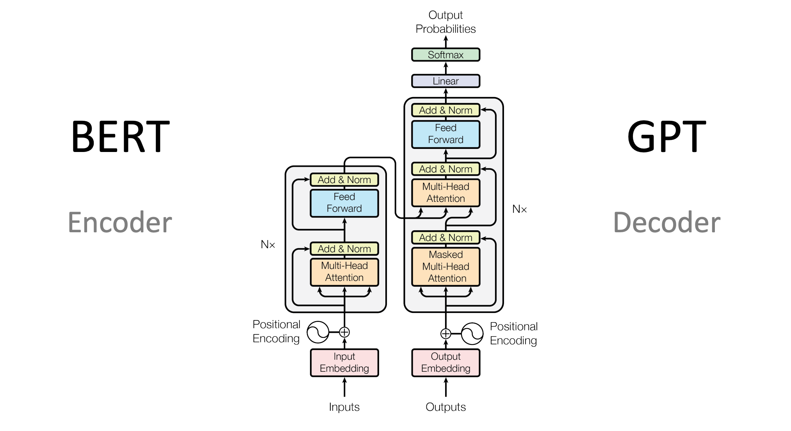

# 600行代码从头训练 GPT-2 训练脚本

## 前言

Andrej Karpathy 最近发布了nanochat， 代码非常精简，且质量很高，是学习大模型训练的很好的材料。

然而，直接阅读代码可能会错过很多重要的设计细节和背后的原理。比如：

- 特殊初始化某些层
- 对参数分组应用不同的权重衰减策略
- 梯度累积和 DDP 的 `require_backward_grad_sync` 如何配合工作
-  vocab_size 要设为 50304 而不是原始的 50257以提升计算速度

因此，我写了这篇教程，基于他之前写的nanogpt仓库，分析讲解这份训练脚本，这个脚本用600行的代码完成了GPT-2的训练，并且效果超过原始GPT-2。这篇教程会：

- 理解每一行代码的作用和设计动机
- 掌握大模型训练的核心技巧（混合精度、梯度累积、DDP、学习率调度等）
- 学会如何从零开始训练一个语言模型

这个训练的模型只进行了pretrain，没有进行后续的SFT或者RLHF，因此主要是训练基础的续写能力。


最终测试用模型续写5次Hello, I'm a language model，结果如下：

```
生成 1: Hello, I'm a language model, and I'll be a translator to English by the end of the book. If you can't figure that out, then

生成 2: Hello, I'm a language model, so please encourage me if you want to learn it more (and it comes naturally).

生成 3: Hello, I'm a language model, so I should just ignore these as it's hard to understand a machine, but I think that's a good way of

生成 4: Hello, I'm a language model, so to translate it into English I have to copy it and translate it into a particular language. So for example if people

生成 5: Hello, I'm a language model, a system that runs on your browser
```

可以看到，有一定续写能力，但并不多。

并且，GPT-2在HellaSwag的评分为29.4%，本模型为30.38%，略微超过GPT2。


本教程假设你已经有一定的深度学习基础，了解 Transformer 的基本原理。

GPT是标准的Decorder-only架构，如下图所示：



### 环境配置

**使用 uv 快速配置环境**（推荐）：

```bash
# 创建虚拟环境
uv venv
source .venv/bin/activate

# 安装依赖
uv pip install -r requirements.txt
```

具体requirements.txt见代码仓库。

### 数据集

我将数据集上传到了 Hugging Face：
[MLZoo/edu-fineweb-10B](https://huggingface.co/datasets/MLZoo/edu-fineweb-10B)

下载并解压到 `edu_fineweb10B/` 目录即可使用。

### 快速开始


配置好环境后，可以下载[数据集](https://huggingface.co/datasets/MLZoo/edu-fineweb-10B/tree/main)到当前目录的edu_fineweb10B，接着，直接开始训练：

```bash
# 单 GPU 训练
python train_gpt2.py

# 多 GPU 训练（例如 8 张卡）
torchrun --standalone --nproc_per_node=8 train_gpt2.py

# 从 checkpoint 恢复训练
python train_gpt2.py --resume log/model_05000.pt
```

训练日志和 checkpoint 会保存在 `log/` 目录下。

---

## 1) 导入

```python
import os
import math
import time
import inspect
import argparse
from dataclasses import dataclass

import torch
import torch.nn as nn
from torch.nn import functional as F
from hellaswag import render_example, iterate_examples
```

- `inspect`：后面需要检查 `torch.optim.AdamW` 是否支持 `fused=True`（提升速度，见下文优化器）。
- `argparse`：我添加的，用来支持 `--resume` 从 checkpoint 继续训练。
- `dataclass`：用来干净地定义 `GPTConfig` 配置对象。
- `F`：用到 `F.cross_entropy` 与 `F.scaled_dot_product_attention`（flash attention，用来高效计算注意力的 kernel）。

------

## 2) 多头因果自注意力 `CausalSelfAttention`

```python
class CausalSelfAttention(nn.Module):

    def __init__(self, config):
        super().__init__()
        assert config.n_embd % config.n_head == 0
        # [B, T, C] -> [B, T, 3 * C]
        self.c_attn = nn.Linear(config.n_embd, 3 * config.n_embd)
        # [B, T, 3 * C] -> [B, T, C]
        self.c_proj = nn.Linear(config.n_embd, config.n_embd)
        self.c_proj.NANOGPT_SCALE_INIT = 1  # 标记用于初始化时缩放
        self.n_head = config.n_head
        self.n_embd = config.n_embd

    def forward(self, x):
        B, T, C = x.size()  # [B, T, C]
        qkv = self.c_attn(x)  # [B, T, 3C]
        q, k, v = qkv.split(self.n_embd, dim=2)  # 三个 [B, T, C]
        
        # reshape 和 transpose: [B, T, C] -> [B, T, n_head, head_size] -> [B, n_head, T, head_size]
        k = k.view(B, T, self.n_head, C // self.n_head).transpose(1, 2)
        q = q.view(B, T, self.n_head, C // self.n_head).transpose(1, 2)
        v = v.view(B, T, self.n_head, C // self.n_head).transpose(1, 2)

        # Flash Attention with causal mask
        y = F.scaled_dot_product_attention(q, k, v, is_causal=True)

        # [B, n_head, T, head_size] -> [B, T, n_head, head_size] -> [B, T, C]
        y = y.transpose(1, 2).contiguous().view(B, T, C)
        y = self.c_proj(y)
        return y
```

- `assert config.n_embd % config.n_head == 0` 确保总维度能整除头数，即每头大小为整数。

- `self.c_attn = nn.Linear(config.n_embd, 3 * config.n_embd)` 一次性生成 Q、K、V：

  ```python
  qkv = self.c_attn(x)  # [B, T, 3C]
  q, k, v = qkv.split(self.n_embd, dim=2)  # 三个 [B, T, C]
  ```

  这样避免三个独立线性层的 kernel 调度开销。

- `self.c_proj.NANOGPT_SCALE_INIT = 1` 这是**关键标记**，告诉 `_init_weights()` 方法对这层的权重进行特殊缩放
（乘以 $$1/\sqrt{2 \times \text{n\_layer}}$$），用于稳定残差网络中的梯度方差。

- 重排维度以便批量矩阵乘法：

  ```python
  k = k.view(B, T, self.n_head, C // self.n_head).transpose(1, 2)
  q = q.view(B, T, self.n_head, C // self.n_head).transpose(1, 2)
  v = v.view(B, T, self.n_head, C // self.n_head).transpose(1, 2)
  # 结果都是 [B, n_head, T, head_size]
  ```

  目的是让 batch 和 head 在前两维，方便后续by head来计算 $QK^T$。

- `F.scaled_dot_product_attention(q, k, v, is_causal=True)` 使用 PyTorch 内置的 Flash Attention：

  - `is_causal=True` 自动应用因果掩码，禁止看到未来 token

  - 返回 `[B, n_head, T, head_size]`

  - 

  - 这个最终的计算结果等同于自己实现的 QKV 注意力，可以这样写：

    ```python
    # q, k, v: [B, n_head, T, head_size]
    att = (q @ k.transpose(-2, -1)) / math.sqrt(k.size(-1))   # [B, n_head, T, T]
    
    # 生成下三角 mask
    causal_mask = torch.tril(torch.ones(T, T, device=att.device)).bool()
    att = att.masked_fill(~causal_mask, float('-inf'))
    
    att = torch.softmax(att, dim=-1)  # 注意力权重
    y = att @ v  # [B, n_head, T, head_size]
    ```

    - 这里的 `@` 等价于 `torch.matmul`，适用于批量张量乘法，写法更简洁。
    - mask 一定要加，否则注意力会看到未来 token。
    - 手写时效率较低，推荐还是优先用官方的 `F.scaled_dot_product_attention`。

- 转置回原始维度，相当于拼接了多头注意力的特征：

  ```python
  y = y.transpose(1, 2).contiguous().view(B, T, C)
  ```

  `contiguous()` 保证内存连续（transpose 会破坏连续性）。

- `self.c_proj(y)` 首先将所有头的特征（多头注意力输出）拼接回一个整体，再通过线性投影整合信息，最终映射回原始维度 `[B, T, C]`。这一步不仅恢复了通道数，还促进了不同注意力头之间的信息融合。

**细节回顾**

- **Scaled Dot-Product** 公式：
  $$\text{Attn}(Q,K,V)=\text{softmax}\left(\frac{QK^T}{\sqrt{d}}+M\right)V$$
  其中 $M$ 是因果 mask（未来位置为 $-\infty$）。在Transformer中计算注意力分数的时候，还要除上分母 $\sqrt{d}$ 保持数值稳定：若不缩放，$QK^T$ 方差随 $d$ 增大，softmax 会过于尖锐或平缓。

- **一次性 `3C` 投影**：相比三个独立的 `Linear(C, C)` 层，只需一个 kernel 调度，内存读写更高效。这是 Transformer 标准实现的套路。

- **因果掩码的必要性**：自回归模型要求每个位置 $t$ 的预测只能依赖 $x_{1..t}$，不能看 $x_{t+1..T}$。这保证训练与推理一致。不加掩码会"泄露未来"，训练指标虚高但推理时崩掉。

- **`NANOGPT_SCALE_INIT` 与深层稳定性**：在深层残差网络中，若每层残差分支都输出方差 $\sim 1$ 的值，梯度会累积导致爆炸。通过初始化时缩小残差分支末尾的权重（按 $\sim 1/\sqrt{N_{layer}}$ 缩放），能让梯度流平稳，深层训练稳定。见后文 `_init_weights` 详讲。

---

## 3) 前馈网络 `MLP`

```python
class MLP(nn.Module):

    def __init__(self, config):
        super().__init__()
        self.c_fc    = nn.Linear(config.n_embd, 4 * config.n_embd)
        self.gelu    = nn.GELU(approximate='tanh')
        self.c_proj  = nn.Linear(4 * config.n_embd, config.n_embd)
        self.c_proj.NANOGPT_SCALE_INIT = 1

    def forward(self, x):
        x = self.c_fc(x)
        x = self.gelu(x)
        x = self.c_proj(x)
        return x
```

- `self.c_fc = nn.Linear(config.n_embd, 4 * config.n_embd)` 扩张层，将 `[B, T, C]` 升到 `[B, T, 4C]`。4倍是 Transformer 论文和 GPT 的经验设置，提供足够的非线性表达能力而不过度增加参数。
- `self.gelu = nn.GELU(approximate='tanh')` GELU 激活函数，其中 `approximate='tanh'` 使用 tanh 近似而不是精确公式，速度更快且效果相当。
- `self.c_proj = nn.Linear(4 * config.n_embd, config.n_embd)` 压缩层，将 `[B, T, 4C]` 压回 `[B, T, C]`。
- 同样标记 `NANOGPT_SCALE_INIT = 1`，以便初始化时缩放。

---

## 4) Transformer 基本块 `Block`（Pre-LN）

```python
class Block(nn.Module):

    def __init__(self, config):
        super().__init__()
        self.ln_1 = nn.LayerNorm(config.n_embd)
        self.attn = CausalSelfAttention(config)
        self.ln_2 = nn.LayerNorm(config.n_embd)
        self.mlp = MLP(config)
    
    def forward(self, x):
        x = x + self.attn(self.ln_1(x))
        x = x + self.mlp(self.ln_2(x))
        return x
```

- 先做 LayerNorm，再通过注意力，最后与原输入相加（残差连接）。这是 **Pre-LN** 结构。
- 同样的模式应用在 MLP 上。

**小改动**

- GPT-2使用的是Post-LN(norm 在后)
- Pre-LN（norm 在前）相比 Post-LN，梯度流更顺畅，深层网络更稳定，更容易收敛。
- 残差连接让每层学习的是"增量"而不是绝对输出，有利于深层优化。

---

## 5) 配置对象 `GPTConfig`

```python
@dataclass
class GPTConfig:
    block_size: int = 1024
    vocab_size: int = 50257
    n_layer: int = 12
    n_head: int = 12
    n_embd: int = 768
```

**说明**

这些参数完全对应 GPT-2 small（124M）的配置。集中管理超参便于复用和替换。

---

## 6) 顶层模型 `GPT`：embedding、堆叠、输出头和权重初始化

```python
class GPT(nn.Module):
    
    def __init__(self, config):
        super().__init__()
        self.config = config

        self.transformer = nn.ModuleDict(dict(
            wte = nn.Embedding(config.vocab_size, config.n_embd),
            wpe = nn.Embedding(config.block_size, config.n_embd),
            h = nn.ModuleList([Block(config) for _ in range(config.n_layer)]),
            ln_f = nn.LayerNorm(config.n_embd),
        ))
        self.lm_head = nn.Linear(config.n_embd, config.vocab_size, bias=False)

        # weight sharing scheme
        self.transformer.wte.weight = self.lm_head.weight

        # 初始化权重
        self.apply(self._init_weights)

    def _init_weights(self, module):
        if isinstance(module, nn.Linear):
            std = 0.02
            if hasattr(module, 'NANOGPT_SCALE_INIT'):
                std *= (2 * self.config.n_layer) ** -0.5
            torch.nn.init.normal_(module.weight, mean=0.0, std=std)
            if module.bias is not None:
                torch.nn.init.zeros_(module.bias)
        elif isinstance(module, nn.Embedding):
            torch.nn.init.normal_(module.weight, mean=0.0, std=0.02)

    def forward(self, idx, targets=None):
        B, T = idx.size()
        assert T <= self.config.block_size, f"Cannot forward sequence of length {T}, block size is only {self.config.block_size}"
        pos = torch.arange(0, T, dtype=torch.long, device=idx.device)
        pos_emb = self.transformer.wpe(pos)
        tok_emb = self.transformer.wte(idx)
        x = tok_emb + pos_emb
        for block in self.transformer.h:
            x = block(x)
        x = self.transformer.ln_f(x)
        logits = self.lm_head(x)
        
        loss = None
        if targets is not None:
            loss = F.cross_entropy(logits.view(-1, logits.size(-1)), targets.view(-1))
        return logits, loss
```


__初始化（`__init__`）__

- `ModuleDict` 包含：
  - `wte`：token embedding，将整数 token ID 映射到 `n_embd` 维向量
  - `wpe`：position embedding，为每个位置 0..T-1 分配 embedding
  - `h`：堆叠 `n_layer` 个 `Block`
  - `ln_f`：最后的 LayerNorm

- `lm_head` 将 `[B, T, C]` 映射到 `[B, T, vocab_size]`，用于预测下一个 token

- **权重共享**——`wte` 和 `lm_head` 共享权重矩阵。这样做：
  - 减少参数数量
  - 让"输入embedding空间"和"输出分类权重空间"保持一致，有利于泛化

__权重初始化（`_init_weights`）__

- 对 Linear 层：
  - 默认标准差为 0.02（标准的 Transformer 初始化）
  - 如果模块有 `NANOGPT_SCALE_INIT` 属性，则乘以 
  $$(2 \times \text{n\_layer})^{-0.5}$$
  - 设计思路：在残差网络中，第 $i$ 层的方差会大约累积 $i$ 倍。在深层（比如 n_layer=12），如果不缩放，残差分支的输出会有过大方差，导致梯度爆炸。这个缩放使得即使在第 n_layer 层，梯度方差仍保持 $\mathcal{O}(1)$ 量级。

- 偏置初始化为 0

- Embedding 层用标准差 0.02 的正态分布初始化

__前向传播（`forward`）__

- 获取输入的 batch size 和序列长度

- 检查序列长度不超过 block_size(最大序列长度)

- 生成位置索引 `[0, 1, ..., T-1]`，查询对应的 position embedding

- 查询 token embedding

- Token embedding 和 position embedding **直接相加**（不是拼接），得到初始隐状态 `[B, T, C]`

- 通过所有 Transformer block

- 最后的 LayerNorm

- 映射到 logits `[B, T, vocab_size]`

- 如果有 targets(训练阶段)，计算交叉熵损失：

  ```
  logits.view(-1, vocab_size) -> [B*T, vocab_size]
  targets.view(-1)            -> [B*T]
  ```

  这相当于把所有时间步的预测展平，计算多分类交叉熵

- **权重共享的理由**：一个充分训练的模型，从 token ID 到 embedding 和从 embedding 到 logits 的映射应该是对称的。共享权重强制这种一致性。

- **位置编码相加而非拼接**：保持维度不变，且实验表明相加和拼接效果相当，相加更高效。

- **F.cross_entropy 的 reshape**：CrossEntropyLoss 要求预测和目标都是展平的形式，便于计算所有位置的 loss 并求平均。

---

## 7) 优化器分组与 AdamW

```python
def configure_optimizers(self, weight_decay, learning_rate, device_type):
    
    param_dict = {pn: p for pn, p in self.named_parameters()}
    param_dict = {pn: p for pn, p in param_dict.items() if p.requires_grad}
    
    decay_params = [p for n, p in param_dict.items() if p.dim() >= 2]
    nodecay_params = [p for n, p in param_dict.items() if p.dim() < 2]
    
    optim_groups = [
        {'params': decay_params, 'weight_decay': weight_decay},
        {'params': nodecay_params, 'weight_decay': 0.0}
    ]
    num_decay_params = sum(p.numel() for p in decay_params)
    num_nodecay_params = sum(p.numel() for p in nodecay_params)
    if master_process:
        print(f"num decayed parameter tensors: {len(decay_params)}, with {num_decay_params:,} parameters")
        print(f"num non-decayed parameter tensors: {len(nodecay_params)}, with {num_nodecay_params:,} parameters")
    
    fused_available = 'fused' in inspect.signature(torch.optim.AdamW).parameters
    use_fused = fused_available and device_type == "cuda"
    
    if master_process:
        print(f"using fused AdamW: {use_fused}")
    optimizer = torch.optim.AdamW(optim_groups, lr=learning_rate, betas=(0.9, 0.95), eps=1e-8, fused=use_fused)
    return optimizer
```

- 获取所有需要梯度的参数，返回 `{name: parameter}` 字典

- **参数分组**——以维度分类：
  - `p.dim() >= 2`：矩阵（Linear 权重、Embedding 权重）→ **应用权重衰减**
  - `p.dim() < 2`：向量（偏置、LayerNorm 参数）→ **不衰减**

- 创建两个优化组，分别指定权重衰减系数

- 统计并打印两类参数数量，用于 sanity check

- 检查 PyTorch 版本是否支持 `fused=True` 的 AdamW（更快的融合实现）

- 仅在 CUDA 上使用 fused 版本

- 创建 AdamW 优化器，其中：
  - `betas=(0.9, 0.95)`：一阶和二阶矩的指数衰减系数（标准 GPT 设置）
  - `eps=1e-8`：数值稳定性常数
  - `fused=use_fused`：若可用则使用融合实现

- **AdamW 的 "W"**：权重衰减（weight decay）在 AdamW 中与梯度更新解耦，直接从参数中减去 $\lambda w$。这不同于 L2 正则（在 loss 中加 $\lambda \|w\|^2$），更稳定。

- **不对偏置和 LayerNorm 衰减**：偏置和归一化参数主要控制平移/缩放，衰减会抵消它们的作用，通常有副作用。

- **Fused AdamW**：将多个操作（梯度更新、EMA、偏差修正等）融合到一个 CUDA kernel，减少 kernel 调度开销和内存读写，显著加速。

---

## 8) Token 加载与数据加载器

```python
def load_tokens(filename):
    npt = np.load(filename)
    npt = npt.astype(np.int32)
    ptt = torch.tensor(npt, dtype=torch.long)
    return ptt

class DataLoaderLite:
    def __init__(self, B, T, process_rank, num_processes, split):
        self.B = B
        self.T = T
        self.process_rank = process_rank
        self.num_processes = num_processes
        assert split in {'train', 'val'}

        data_root = "edu_fineweb10B"
        shards = os.listdir(data_root)
        shards = [s for s in shards if split in s]
        shards = sorted(shards)
        shards = [os.path.join(data_root, s) for s in shards]
        self.shards = shards
        assert len(shards) > 0, f"no shards found for split {split}"
        if master_process:
            print(f"found {len(shards)} shards for split {split}")
        self.reset()

    def reset(self):
        self.current_shard = 0
        self.tokens = load_tokens(self.shards[self.current_shard])
        self.current_position = self.B * self.T * self.process_rank

    def next_batch(self):
        B, T = self.B, self.T
        buf = self.tokens[self.current_position : self.current_position+B*T+1]
        x = (buf[:-1]).view(B, T)
        y = (buf[1:]).view(B, T)
        self.current_position += B * T * self.num_processes
        if self.current_position + (B * T * self.num_processes + 1) > len(self.tokens):
            self.current_shard = (self.current_shard + 1) % len(self.shards)
            self.tokens = load_tokens(self.shards[self.current_shard])
            self.current_position = B * T * self.process_rank
        return x, y
```


__`load_tokens` 函数__

- `def load_tokens(filename)`：
  - `np.load(filename)`：从 `.npy` 文件加载预编码的 token 张量
  - `astype(np.int32)`：转换为 32 位整数
  - `torch.tensor(..., dtype=torch.long)`：转为 PyTorch 张量，使用 `long` 类型（与 embedding 查询兼容）

__`DataLoaderLite` 类__（支持DDP多卡训练）

- `def __init__(self, B, T, process_rank, num_processes, split):`

  - `B, T, process_rank, num_processes`：micro batch size、序列长度、进程 rank、总进程数
  - `split`：'train' 或 'val'

  - 在 `edu_fineweb10B` 目录下查找包含 split 名称的文件（如 `train_00.bin`）
  - 排序以保证一致性
  - 拼接完整路径

- `reset()` 初始化状态:

  - `current_shard = 0`：从第一个 shard 开始
  - 加载第一个 shard 的 token
  - `current_position = B * T * process_rank`：**多进程偏移**在 DDP 中，不同 rank 从不同位置开始读，避免重复数据。比如 rank 0 从 0 开始，rank 1 从 `B*T` 开始，rank 2 从 `2*B*T` 开始

- `next_batch()` 取下一个批次

  - 从 `current_position` 取 `B*T+1` 个 token（+1 是因为要构造 (x, y) 对）

  - `x = buf[:-1]`：前 `B*T` 个 token（输入）
  - `y = buf[1:]`：后 `B*T` 个 token（目标），这样每个位置的目标就是它的下一个 token
  - 对此 reshape 为 `[B, T]`
  - `current_position += B * T * num_processes`下一个 batch 从 `current_position + B*T*num_processes` 开始（跳过其他进程的数据）

  - 如果当前 shard 读完，轮转到下一个 shard`current_shard = (current_shard + 1) % len(shards)` 循环轮转，重新加载 token，并重置 `current_position` 按当前 rank 偏移

**设计思路**

- **预编码 token**：使用 `.npy` 格式存储已编码的 token（而不是原始文本），可以直接加载到内存，避免每轮都 tokenize。

- **多 shard 流式加载**：10B token 太大，无法一次性加载到显存。按 shard 加载，读完一个后加载下一个，形成流式处理。

- **多进程错位采样**：在 DDP 中，每个进程从不同起点读，比如 rank 0 读位置 0, `num_processes*B*T`, `2*num_processes*B*T`, ...；rank 1 读位置 `B*T`, `B*T + num_processes*B*T`, ...。这样能最大化数据覆盖率，避免所有进程都读同样的数据。

- **`(x, y)` 对的构造**：自回归语言模型的标准做法——目标是"下一个 token"，所以 `y` 右移一位。这样在时间步 $t$，模型预测的是 $x_t$，而真实目标是 $x_{t+1}$。

---

## 9) HellaSwag 评测

Andrej Karpathy在训练过程中也加入了HellaSwag评测，用来对比我们从头训练的模型和GPT-2模型的性能。

### 什么是 HellaSwag？

**HellaSwag** 是一个常识推理评测基准，用于测试语言模型的**常识推理能力**和**语境理解能力**。它于 2019 年由华盛顿大学提出，是目前最具挑战性的语言理解评测之一。

**数据集结构**：

- 每个样本包含一个**上下文/提示句**（context）
- 以及**4 个候选补全句**（completions），其中只有 1 个是正确的
- 任务是让模型选出最合理的那个补全

**举例**：

```
上下文：一个女孩正在吹头发...
候选1：然后她关掉吹风机，开始梳头。 ✓（正确）
候选2：然后她把吹风机放进冰箱里。
候选3：然后她用吹风机吹猫。
候选4：然后她开始飞向天空。
```

错误选项通常是对抗样本（adversarial），语法正确但逻辑荒谬，专门用来迷惑模型。

### 评测逻辑

**核心思路**：对于每个样本，将 4 个候选分别与上下文拼接，让模型计算每个候选的**条件似然**（likelihood），选择似然最大的作为预测。

**评测流程**：

1. **拼接**：将上下文（context）+ 每个候选（completion）拼接成完整句子

   ```
   完整句子 = context + completion_i  (i=1,2,3,4)
   ```

2. **计算似然**：用语言模型计算每个完整句子的对数似然

$$
   log P(\text{completion}_i | \text{context}) = \sum {}\log P(\text{token}_t | \text{context}, \text{token}_{<t})
$$

3. **只在补全部分计算**：这里的关键是只计算 completion 部分的似然，而不包括 context 部分

   - 为什么？因为 context 对所有候选都一样，不影响比较
   - mask 就是用来标记哪些 token 属于 completion 部分

4. **平均归一化**：计算每个 token 的平均对数似然（因为候选长度可能不同）
   $$
   \text{score}_i = (1/|\text{completion}_i|) × Σ log P(\text{token}_t | ...)
   $$

5. **选择最佳**：选择 score 最高（等价于 loss 最低）的候选作为预测

6. **计算准确率**：预测是否与标注答案一致

###  HellaSwag 的重要性

- **考察常识推理**：不是简单的模式匹配，需要理解物理世界的因果关系
- **对抗鲁棒性**：错误选项是精心设计的对抗样本，能有效区分模型能力
- **GPT-4 基准**：GPT-3 在 HellaSwag 上达到 ~79%，GPT-4 达到 ~95%，是衡量模型智能的重要指标

---

### 代码实现

下面是计算最可能候选的核心函数：

```python
def get_most_likely_row(tokens, mask, logits):
    shift_logits = (logits[..., :-1, :]).contiguous()
    shift_tokens = (tokens[..., 1:]).contiguous()
    flat_shift_logits = shift_logits.view(-1, shift_logits.size(-1))
    flat_shift_tokens = shift_tokens.view(-1)
    shift_losses = F.cross_entropy(flat_shift_logits, flat_shift_tokens, reduction='none')
    shift_losses = shift_losses.view(tokens.size(0), -1)
    shift_mask = (mask[..., 1:]).contiguous()
    masked_shift_losses = shift_losses * shift_mask
    sum_loss = masked_shift_losses.sum(dim=1)
    avg_loss = sum_loss / shift_mask.sum(dim=1)
    pred_norm = avg_loss.argmin().item()
    return pred_norm
```

**函数作用**

这个函数接收 HellaSwag 的 4 个候选完成句（tokens `[4, T]`）、mask `[4, T]` 和模型的 logits `[4, T, vocab_size]`，返回最可能的候选索引。

**右移对齐**

```python
shift_logits = (logits[..., :-1, :]).contiguous()
shift_tokens = (tokens[..., 1:]).contiguous()
```

- `shift_logits`：取前 T-1 个 logits（预测位置 0~T-2 的下一个 token）
- `shift_tokens`：取位置 1~T 的真实 token（作为预测目标）

这是因为语言模型预测"下一个 token"，所以 logits 和 tokens 要错位对齐。

**展平并计算 loss**

```python
flat_shift_logits = shift_logits.view(-1, shift_logits.size(-1))  # [4*(T-1), vocab]
flat_shift_tokens = shift_tokens.view(-1)  # [4*(T-1)]
shift_losses = F.cross_entropy(flat_shift_logits, flat_shift_tokens, reduction='none')
shift_losses = shift_losses.view(tokens.size(0), -1)  # [4, T-1]
```

将 4 个候选展平计算交叉熵，`reduction='none'` 保留每个位置的 loss，然后 reshape 回 `[4, T-1]`。

**只在补全区间计算**

```python
shift_mask = (mask[..., 1:]).contiguous()
masked_shift_losses = shift_losses * shift_mask
```

- `shift_mask`：mask 也要右移，与 tokens 对齐
- `masked_shift_losses`：将提示部分（mask=0）的 loss 清零

**计算平均 loss 并选择最佳候选**

```python
sum_loss = masked_shift_losses.sum(dim=1)  # [4]
avg_loss = sum_loss / shift_mask.sum(dim=1)  # [4]
pred_norm = avg_loss.argmin().item()
```

对每个候选，计算补全部分的平均 loss，选择 loss 最小（似然最大）的

**设计逻辑**

- **只在补全区间计算 loss**：HellaSwag 数据集由"提示句"和"四个候选完成"组成。提示往往容易预测（几乎任何语言模型都能做对），所以不应该用它来评测模型能力。只看补全部分，评测才敏感。

- **平均而非求和**：不同候选的补全长度可能不同，用平均能公平比较，避免长补全因为有更多 token 而累积更大的 loss。

- **选最小 loss 对应的候选**：loss 越小 = 似然越大 = 模型越相信这是正确的补全，所以应该选 loss 最小的。

---

## 10) 设备、分布式初始化与超参

代码在启动时支持多卡启动，在启动时，要使用torchrun命令。

```
torchrun --nproc_per_node=8 train_gpt2.py
```

（8 为使用的 GPU 数目，可以调整；train.py 是脚本名）

`torchrun --standalone --nproc_per_node=4 train_gpt2.py`
脚本会自动根据环境变量进行分布式初始化，无需额外修改代码。

```python
ddp = int(os.environ.get('RANK', -1)) != -1
if ddp:
    assert torch.cuda.is_available(), "for now i think we need CUDA for DDP"
    init_process_group(backend='nccl')
    ddp_rank = int(os.environ['RANK'])
    ddp_local_rank = int(os.environ['LOCAL_RANK'])
    ddp_world_size = int(os.environ['WORLD_SIZE'])
    device = f'cuda:{ddp_local_rank}'
    torch.cuda.set_device(device)
    master_process = ddp_rank == 0
else:
    ddp_rank = 0
    ddp_local_rank = 0
    ddp_world_size = 1
    master_process = True
    device = "cpu"
    if torch.cuda.is_available():
        device = "cuda"
    elif hasattr(torch.backends, "mps") and torch.backends.mps.is_available():
        device = "mps"
    print(f"using device: {device}")

device_type = "cuda" if device.startswith("cuda") else "cpu"

torch.manual_seed(1337)
if torch.cuda.is_available():
    torch.cuda.manual_seed(1337)

enc = tiktoken.get_encoding("gpt2")

total_batch_size = 524288  # 2**19, ~0.5M tokens
B = 16
T = 1024
assert total_batch_size % (B * T * ddp_world_size) == 0
grad_accum_steps = total_batch_size // (B * T * ddp_world_size)
```

**检测 DDP 模式**

```python
ddp = int(os.environ.get('RANK', -1)) != -1
```

通过检查环境变量 `RANK` 是否存在来判断是否是分布式训练。`torchrun` 启动时会自动设置这些环境变量。

**DDP 模式初始化**

```python
if ddp:
    init_process_group(backend='nccl')
    ddp_rank = int(os.environ['RANK'])
    ddp_local_rank = int(os.environ['LOCAL_RANK'])
    ddp_world_size = int(os.environ['WORLD_SIZE'])
    device = f'cuda:{ddp_local_rank}'
    torch.cuda.set_device(device)
    master_process = ddp_rank == 0
```

- `init_process_group('nccl')`：初始化进程组，NCCL 是 NVIDIA GPU 间的高效通信后端
- 从环境变量获取 rank 信息，进程编号、本地编号、总进程数(一共多少张卡)
- `torch.cuda.set_device(device)`：绑定 GPU，防止多个进程竞争同一张 GPU
- `master_process = ddp_rank == 0`：只有 rank 0 进程做日志输出和 checkpoint 保存


**单机模式**

```python
else:
    ddp_rank = 0
    ddp_local_rank = 0
    ddp_world_size = 1
    master_process = True
    device = "cpu"
    if torch.cuda.is_available():
        device = "cuda"
    elif hasattr(torch.backends, "mps") and torch.backends.mps.is_available():
        device = "mps"
```

非 DDP 模式下，设置 `device` 为可用的最佳设备（优先级：cuda > mps > cpu）。

**设备类型**

```python
device_type = "cuda" if device.startswith("cuda") else "cpu"
```

`torch.autocast()` 需要的参数，只能是 `'cuda'` 或 `'cpu'`。

**随机种子**

```python
torch.manual_seed(1337)
if torch.cuda.is_available():
    torch.cuda.manual_seed(1337)
```

设置随机种子保证可复现性。注意：这里所有进程用同一个 seed，在某些情况下可能导致数据增强完全一致,其实可以考虑加上ddp_rank。

**Tokenizer**

```python
enc = tiktoken.get_encoding("gpt2")
```

加载 GPT-2 的 BPE tokenizer。

**batch大小与梯度累积**

```python
total_batch_size = 524288  # 2**19, ~0.5M tokens
B = 16
T = 1024
assert total_batch_size % (B * T * ddp_world_size) == 0
grad_accum_steps = total_batch_size // (B * T * ddp_world_size)
```

- `total_batch_size = 524288`：匹配GPT-3中的设定，等效大批量，约 0.5M tokens
- `B = 16`：micro batch size（每个进程每步的批大小）这里为了简单没有遵循GPT-2的动态batch，而且这也不是GPT-2主要的优化手段
- `T = 1024`：序列长度
- `grad_accum_steps`：梯度累积步数 = 总批量 / (micro batch × 进程数)

**梯度累积**：大批量训练能稳定统计（BatchNorm、梯度估计更准确），但显存有限。梯度累积让我们用多个小批量的梯度累加，数学上等效于一个大批量，但显存占用还是小批量

- **Gradient Accumulation**：0.5M token 的批量很难一步加入显存，所以拆成多个小步累积。这在数学上等效于大批量（同样的梯度除以步数），但显存占用还是小批量。

---

## 11) 模型构造与训练参数

```python
model = GPT(GPTConfig(vocab_size=50304))

parser = argparse.ArgumentParser()
parser.add_argument("--resume", type=str, default=None, help="Resume from checkpoint")
args = parser.parse_args()

start_step = 0
if args.resume:
    ckpt = torch.load(args.resume, map_location=device, weights_only=False)
    model.load_state_dict(ckpt['model'])
    start_step = ckpt['step'] + 1
    if master_process:
        print(f"✓ 从 {args.resume} 恢复训练 (第 {start_step} 步开始)")

model.to(device)
use_compile = False
if use_compile:
    model = torch.compile(model)
if ddp:
    model = DDP(model, device_ids=[ddp_local_rank])
raw_model = model.module if ddp else model

max_lr = 6e-4
min_lr = max_lr * 0.1
warmup_steps = 715
max_steps = 19073

def get_lr(it):
    if it < warmup_steps:
        return max_lr * (it+1) / warmup_steps
    if it > max_steps:
        return min_lr
    decay_ratio = (it - warmup_steps) / (max_steps - warmup_steps)
    assert 0 <= decay_ratio <= 1
    coeff = 0.5 * (1.0 + math.cos(math.pi * decay_ratio))
    return min_lr + coeff * (max_lr - min_lr)

optimizer = raw_model.configure_optimizers(weight_decay=0.1, learning_rate=6e-4, device_type=device_type)
```

**创建模型**

```python
model = GPT(GPTConfig(vocab_size=50304))
```

`vocab_size=50304` 而不是原始的 50257，是为了对齐到 256 的倍数。某些 CUDA kernel（如 mixed precision matmul）对 warp 大小有对齐要求，这样可以提升吞吐量。

**支持断点续训**

```python
parser = argparse.ArgumentParser()
parser.add_argument("--resume", type=str, default=None, help="Resume from checkpoint")
args = parser.parse_args()

start_step = 0
if args.resume:
    ckpt = torch.load(args.resume, map_location=device, weights_only=False)
    model.load_state_dict(ckpt['model'])
    start_step = ckpt['step'] + 1
```

- `--resume` 参数指定 checkpoint 路径
- `map_location=device`：将 checkpoint 加载到当前设备
- `weights_only=False`：允许加载完整的 checkpoint 对象（不仅仅是权重）
- `start_step`：从 checkpoint 保存的步数继续训练

**模型部署到设备**

```python
model.to(device)
use_compile = False
if use_compile:
    model = torch.compile(model)
if ddp:
    model = DDP(model, device_ids=[ddp_local_rank])
raw_model = model.module if ddp else model
```

- `model.to(device)`：将模型移到 GPU/CPU
- `torch.compile()`：PyTorch 2.0 的编译优化，但与 HellaSwag eval 有兼容性问题，所以设为 False
- `DDP(model, ...)`：如果是分布式训练，包装模型为 DDP 版本
- `raw_model`：保留原始模型引用，因为 DDP 包装后需要用 `.module` 才能访问原始模型

**学习率调度**

```python
max_lr = 6e-4
min_lr = max_lr * 0.1
warmup_steps = 715
max_steps = 19073

def get_lr(it):
    if it < warmup_steps:
        return max_lr * (it+1) / warmup_steps
    if it > max_steps:
        return min_lr
    decay_ratio = (it - warmup_steps) / (max_steps - warmup_steps)
    assert 0 <= decay_ratio <= 1
    coeff = 0.5 * (1.0 + math.cos(math.pi * decay_ratio))
    return min_lr + coeff * (max_lr - min_lr)
```

这是一个 **warmup + 余弦衰减** 的学习率调度器：

- **Warmup 阶段**（0~715 步）：学习率从 0 线性增长到 `max_lr`
- **余弦衰减阶段**（715~19073 步）：学习率按余弦曲线平滑下降到 `min_lr`
- **训练步数**：19073 步 ≈ 10B tokens / (0.5M tokens per step) ≈ 1 epoch

**创建优化器**

```python
optimizer = raw_model.configure_optimizers(weight_decay=0.1, learning_rate=6e-4, device_type=device_type)
```

调用模型的 `configure_optimizers` 方法（前面第 7 章讲过），创建带参数分组的 AdamW 优化器

**设计逻辑**

- **Vocab size = 50304**：原始GPT-2其实只有50257个vocab_size，而这里加了 47 个，填充到 256 的倍数。虽然增加了计算量，反而因为某些 CUDA kernel（如 mixed precision matmul）对 warp 大小有对齐要求，从而提升了吞吐。

- **Warmup 的目的**：训练初期，梯度估计和 batch norm/layer norm 统计都不稳定。warmup 让学习率从小到大，给模型和优化器统计留出时间。

- **余弦衰减**：比线性衰减更平滑，后期学习率更小，利于收敛和泛化。

- **从 checkpoint 恢复**：长时间训练必须支持中断和恢复，存盘 step 信息便于继续。

---

## 12) 训练主循环

```python
log_dir = "log"
os.makedirs(log_dir, exist_ok=True)
log_file = os.path.join(log_dir, f"log.txt")
with open(log_file, "w") as f:
    pass

for step in range(start_step, max_steps):
    t0 = time.time()
    last_step = (step == max_steps - 1)

    # 周期性验证（每 250 步或最后一步）
    if step % 250 == 0 or last_step:
        model.eval()
        val_loader.reset()
        with torch.no_grad():
            val_loss_accum = 0.0
            val_loss_steps = 20
            for _ in range(val_loss_steps):
                x, y = val_loader.next_batch()
                x, y = x.to(device), y.to(device)
                with torch.autocast(device_type=device_type, dtype=torch.bfloat16):
                    logits, loss = model(x, y)
                loss = loss / val_loss_steps
                val_loss_accum += loss.detach()
        if ddp:
            dist.all_reduce(val_loss_accum, op=dist.ReduceOp.AVG)
        if master_process:
            print(f"validation loss: {val_loss_accum.item():.4f}")
            with open(log_file, "a") as f:
                f.write(f"{step} val {val_loss_accum.item():.4f}\n")
            if step > 0 and (step % 5000 == 0 or last_step):
                checkpoint_path = os.path.join(log_dir, f"model_{step:05d}.pt")
                checkpoint = {
                    'model': raw_model.state_dict(),
                    'config': raw_model.config,
                    'step': step,
                    'val_loss': val_loss_accum.item()
                }
                torch.save(checkpoint, checkpoint_path)

    # HellaSwag 评测（每 250 步）
    if (step % 250 == 0 or last_step) and (not use_compile):
        num_correct_norm = 0
        num_total = 0
        for i, example in enumerate(iterate_examples("val")):
            if i % ddp_world_size != ddp_rank:
                continue
            _, tokens, mask, label = render_example(example)
            tokens = tokens.to(device)
            mask = mask.to(device)
            with torch.no_grad():
                with torch.autocast(device_type=device_type, dtype=torch.bfloat16):
                    logits, loss = model(tokens)
                pred_norm = get_most_likely_row(tokens, mask, logits)
            num_total += 1
            num_correct_norm += int(pred_norm == label)
        if ddp:
            num_total = torch.tensor(num_total, dtype=torch.long, device=device)
            num_correct_norm = torch.tensor(num_correct_norm, dtype=torch.long, device=device)
            dist.all_reduce(num_total, op=dist.ReduceOp.SUM)
            dist.all_reduce(num_correct_norm, op=dist.ReduceOp.SUM)
            num_total = num_total.item()
            num_correct_norm = num_correct_norm.item()
        acc_norm = num_correct_norm / num_total
        if master_process:
            print(f"HellaSwag accuracy: {num_correct_norm}/{num_total}={acc_norm:.4f}")
            with open(log_file, "a") as f:
                f.write(f"{step} hella {acc_norm:.4f}\n")

    # 生成预览（每 250 步）
    if ((step > 0 and step % 250 == 0) or last_step) and (not use_compile):
        model.eval()
        num_return_sequences = 4
        max_length = 32
        tokens = enc.encode("Hello, I'm a language model,")
        tokens = torch.tensor(tokens, dtype=torch.long)
        tokens = tokens.unsqueeze(0).repeat(num_return_sequences, 1)
        xgen = tokens.to(device)
        sample_rng = torch.Generator(device=device)
        sample_rng.manual_seed(42 + ddp_rank)
        while xgen.size(1) < max_length:
            with torch.no_grad():
                with torch.autocast(device_type=device_type, dtype=torch.bfloat16):
                    logits, loss = model(xgen)
                logits = logits[:, -1, :]  # 只看最后一个位置
                probs = F.softmax(logits, dim=-1)
                topk_probs, topk_indices = torch.topk(probs, 50, dim=-1)
                ix = torch.multinomial(topk_probs, 1, generator=sample_rng)
                xcol = torch.gather(topk_indices, -1, ix)
                xgen = torch.cat((xgen, xcol), dim=1)
        for i in range(num_return_sequences):
            tokens = xgen[i, :max_length].tolist()
            decoded = enc.decode(tokens)
            print(f"rank {ddp_rank} sample {i}: {decoded}")

    # 训练步
    model.train()
    optimizer.zero_grad()
    loss_accum = 0.0
    for micro_step in range(grad_accum_steps):
        x, y = train_loader.next_batch()
        x, y = x.to(device), y.to(device)
        if ddp:
            model.require_backward_grad_sync = (micro_step == grad_accum_steps - 1)
        with torch.autocast(device_type=device_type, dtype=torch.bfloat16):
            logits, loss = model(x, y)
        loss = loss / grad_accum_steps
        loss_accum += loss.detach()
        loss.backward()
    if ddp:
        dist.all_reduce(loss_accum, op=dist.ReduceOp.AVG)
    norm = torch.nn.utils.clip_grad_norm_(model.parameters(), 1.0)
    lr = get_lr(step)
    for param_group in optimizer.param_groups:
        param_group['lr'] = lr
    optimizer.step()
    if device_type == "cuda":
        torch.cuda.synchronize()
    t1 = time.time()
    dt = t1 - t0
    tokens_processed = train_loader.B * train_loader.T * grad_accum_steps * ddp_world_size
    tokens_per_sec = tokens_processed / dt
    if master_process:
        print(f"step {step:5d} | loss: {loss_accum.item():.6f} | lr {lr:.4e} | norm: {norm:.4f} | dt: {dt*1000:.2f}ms | tok/sec: {tokens_per_sec:.2f}")
        with open(log_file, "a") as f:
            f.write(f"{step} train {loss_accum.item():.6f}\n")

if ddp:
    destroy_process_group()
```


__验证阶段__

**切换到评估模式**

```python
model.eval()
val_loader.reset()
with torch.no_grad():
    val_loss_accum = 0.0
    val_loss_steps = 20
    for _ in range(val_loss_steps):
        x, y = val_loader.next_batch()
        x, y = x.to(device), y.to(device)
        with torch.autocast(device_type=device_type, dtype=torch.bfloat16):
            logits, loss = model(x, y)
        loss = loss / val_loss_steps
        val_loss_accum += loss.detach()
```

- `model.eval()`：切换到评估模式（禁用 dropout、BatchNorm 用累积统计等）
- `val_loader.reset()`：重置验证数据加载器到起点
- `torch.no_grad()`：禁用梯度计算，节省显存
- 循环 20 步验证，累积平均 loss
- `torch.autocast(dtype=torch.bfloat16)`：自动混合精度，加速推理

**合并多进程结果并保存 checkpoint**

```python
if ddp:
    dist.all_reduce(val_loss_accum, op=dist.ReduceOp.AVG)
if master_process:
    print(f"validation loss: {val_loss_accum.item():.4f}")
    with open(log_file, "a") as f:
        f.write(f"{step} val {val_loss_accum.item():.4f}\n")
    if step > 0 and (step % 5000 == 0 or last_step):
        checkpoint_path = os.path.join(log_dir, f"model_{step:05d}.pt")
        checkpoint = {
            'model': raw_model.state_dict(),
            'config': raw_model.config,
            'step': step,
            'val_loss': val_loss_accum.item()
        }
        torch.save(checkpoint, checkpoint_path)
```

- `dist.all_reduce(..., AVG)`：多进程时平均各进程的验证 loss
- 仅主进程打印日志和保存 checkpoint（每 5000 步或最后一步）

__HellaSwag 评测__

**多进程分工**

```python
for i, example in enumerate(iterate_examples("val")):
    if i % ddp_world_size != ddp_rank:
        continue
    _, tokens, mask, label = render_example(example)
```

- 用 `i % ddp_world_size == ddp_rank` 让不同进程处理不同样本，避免重复计算
- `render_example()` 将原始数据转为 tokens、mask 和 label

**计算准确率**

```python
with torch.no_grad():
    with torch.autocast(device_type=device_type, dtype=torch.bfloat16):
        logits, loss = model(tokens)
    pred_norm = get_most_likely_row(tokens, mask, logits)
num_total += 1
num_correct_norm += int(pred_norm == label)
```

调用前面讲的 `get_most_likely_row()` 函数，选择最可能的候选。

**合并结果**

```python
if ddp:
    num_total = torch.tensor(num_total, dtype=torch.long, device=device)
    num_correct_norm = torch.tensor(num_correct_norm, dtype=torch.long, device=device)
    dist.all_reduce(num_total, op=dist.ReduceOp.SUM)
    dist.all_reduce(num_correct_norm, op=dist.ReduceOp.SUM)
acc_norm = num_correct_norm / num_total
```

多进程时，用 `SUM` 操作合并各进程的计数，计算总准确率。

__生成预览__

**准备输入**

```python
tokens = enc.encode("Hello, I'm a language model,")
tokens = torch.tensor(tokens, dtype=torch.long)
tokens = tokens.unsqueeze(0).repeat(num_return_sequences, 1)
xgen = tokens.to(device)
sample_rng = torch.Generator(device=device)
sample_rng.manual_seed(42 + ddp_rank)
```

- 固定提示 "Hello, I'm a language model,"
- 复制 4 次用于并行生成
- 创建独立的随机数生成器（不同 rank 用不同 seed）

**自回归生成**

```python
while xgen.size(1) < max_length:
    with torch.no_grad():
        with torch.autocast(device_type=device_type, dtype=torch.bfloat16):
            logits, loss = model(xgen)
        logits = logits[:, -1, :]  # 只看最后一个位置
        probs = F.softmax(logits, dim=-1)
        topk_probs, topk_indices = torch.topk(probs, 50, dim=-1)
        ix = torch.multinomial(topk_probs, 1, generator=sample_rng)
        xcol = torch.gather(topk_indices, -1, ix)
        xgen = torch.cat((xgen, xcol), dim=1)
```

- `logits[:, -1, :]`：只取最后一个 token 的预测（下一个 token）
- Top-K 采样：保留概率最高的 50 个 token，从中采样
- `torch.gather()`：根据采样索引取出真实的 token ID
- `torch.cat()`：追加到序列，继续生成

__训练步__

**梯度累积循环**

```python
model.train()
optimizer.zero_grad()
loss_accum = 0.0
for micro_step in range(grad_accum_steps):
    x, y = train_loader.next_batch()
    x, y = x.to(device), y.to(device)
    if ddp:
        model.require_backward_grad_sync = (micro_step == grad_accum_steps - 1)
    with torch.autocast(device_type=device_type, dtype=torch.bfloat16):
        logits, loss = model(x, y)
    loss = loss / grad_accum_steps
    loss_accum += loss.detach()
    loss.backward()
```

- `model.train()`：切回训练模式
- `optimizer.zero_grad()`：清零梯度
- `model.require_backward_grad_sync = ...`：**DDP 优化关键**
  - 只在最后一个 micro step 同步梯度，前面的 step 各自反向传播不同步
  - 大幅减少通信开销
- `loss / grad_accum_steps`：归一化 loss，使梯度累加等效于大批量

**梯度裁剪与优化器步**

```python
if ddp:
    dist.all_reduce(loss_accum, op=dist.ReduceOp.AVG)
norm = torch.nn.utils.clip_grad_norm_(model.parameters(), 1.0)
lr = get_lr(step)
for param_group in optimizer.param_groups:
    param_group['lr'] = lr
optimizer.step()
```

- `clip_grad_norm_(..., 1.0)`：**梯度裁剪**，限制梯度范数不超过 1.0
  - **为什么必须**：长序列 Transformer 容易梯度爆炸，不裁剪会出现 NaN
- `get_lr(step)`：根据当前步数获取学习率
- 更新每个参数组的学习率，执行优化器步

**计算吞吐**

```python
if device_type == "cuda":
    torch.cuda.synchronize()
t1 = time.time()
dt = t1 - t0
tokens_processed = train_loader.B * train_loader.T * grad_accum_steps * ddp_world_size
tokens_per_sec = tokens_processed / dt
```

- `torch.cuda.synchronize()`：等待所有 GPU 操作完成，保证计时准确
- 计算每秒处理的 token 数（衡量训练效率的关键指标）

- **混合精度（bfloat16）**：matmul 等高吞吐操作用低精度（bfloat16 有足够的指数位，比 fp16 稳定），reduce 和 loss 用高精度（float32）。节省显存和时间，同时保持数值稳定。

- **梯度累积**：显存有限，但需要大批量。累积多个 micro step 的梯度，等效一步大批量更新，但显存占用是 micro batch。

- **梯度裁剪**：RNN 和长序列 Transformer 容易梯度爆炸。裁剪保证稳定性。

- **DDP 的 `require_backward_grad_sync`**：梯度同步是通信瓶颈。累积的前 k-1 步只做本地反向传播，最后一步才同步梯度，减少同步次数，加速训练。

- **学习率调度**：warmup 让初期更稳定，余弦衰减让后期微调。

- **周期性验证和 checkpoint**：监控泛化，存最优模型便于后续使用和恢复。

---

## 总结

通过这篇教程，我们完整地剖析了 Andrej Karpathy 的 nanogpt 训练脚本。让我们回顾一下关键内容：

### 模型架构（第 2-6 章）

1. **CausalSelfAttention（多头因果自注意力）**
   - 一次性 `3C` 投影生成 Q、K、V，减少 kernel 调度
   - 使用 PyTorch 的 Flash Attention 实现高效计算
   - `NANOGPT_SCALE_INIT` 标记用于残差分支的特殊初始化

2. **MLP（前馈网络）**
   - 4 倍扩张 + GELU 激活 + 压缩回原始维度
   - 与注意力机制互补，提供逐位置的非线性变换

3. **Block（Transformer 块）**
   - Pre-LN 结构（norm 在前），比 Post-LN 更稳定
   - 残差连接让每层学习"增量"

4. **GPT 模型**
   - Token embedding 和 position embedding 直接相加
   - **权重共享**：`wte` 和 `lm_head` 共享权重，减少参数
   - **特殊初始化**：残差分支末尾的权重按 $1/\sqrt{2 \times n_{layer}}$ 缩放

### 训练技巧（第 7-12 章）

5. **AdamW 优化器与参数分组**
   - 矩阵参数（≥2D）应用权重衰减，偏置和 LayerNorm 参数不衰减
   - Fused AdamW 融合多个操作到一个 CUDA kernel

6. **数据加载**
   - 预编码 token 存储在 `.npy` 文件中
   - 多 shard 流式加载，避免一次性加载 10B tokens
   - DDP 模式下多进程错位采样，最大化数据覆盖率

7. **HellaSwag 评测**
   - 常识推理能力的重要评测基准
   - 只在补全部分计算似然，用平均 NLL 选择最佳候选

8. **分布式训练（DDP）**
   - 使用 `torchrun` 启动多进程训练
   - NCCL 后端实现高效的 GPU 间通信
   - `require_backward_grad_sync` 优化：只在最后一个 micro step 同步梯度

9. **训练超参**
   - Vocab size 对齐到 256 的倍数（50304）提升吞吐
   - Warmup + 余弦衰减的学习率调度
   - 梯度累积模拟 0.5M tokens 的大批量

10. **训练循环**
    - **混合精度**：bfloat16 加速且保持数值稳定
    - **梯度裁剪**：防止梯度爆炸
    - **周期性验证**：监控泛化能力
    - **HellaSwag 评测和生成预览**：直观观察训练进度

### 关键设计原则

这份代码体现了几个重要的设计原则：

1. **简洁而不简单**：600 行代码包含了现代大模型训练的所有核心技术
2. **效率优化**：Flash Attention、Fused AdamW、混合精度、梯度累积
3. **稳定性保证**：特殊初始化、梯度裁剪、Warmup、Pre-LN
4. **工程实践**：DDP 分布式、断点续训、周期性验证

### 实践建议

如果你想基于这份代码进行实验，可以考虑：

- **数据集**：使用 FineWeb-Edu 等高质量数据集
- **规模扩展**：调整 `n_layer`、`n_head`、`n_embd` 训练更大模型
- **优化器**：尝试 Lion、AdamW 的不同变体
- **学习率**：根据模型大小调整 warmup 步数和最大学习率
- **评测**：添加更多评测基准（MMLU、GSM8K 等）

希望这篇教程能帮助你深入理解大模型训练的细节。记住，读懂代码只是第一步，真正的学习来自于实践和实验。祝你在大模型训练的道路上越走越远！

---

**参考资源**：

- [nanogpt 仓库](https://github.com/karpathy/nanoGPT)
- [Andrej Karpathy 的视频教程](https://www.youtube.com/watch?v=kCc8FmEb1nY)
- [GPT-2 论文](https://cdn.openai.com/better-language-models/language_models_are_unsupervised_multitask_learners.pdf)
- [Attention Is All You Need](https://arxiv.org/abs/1706.03762)